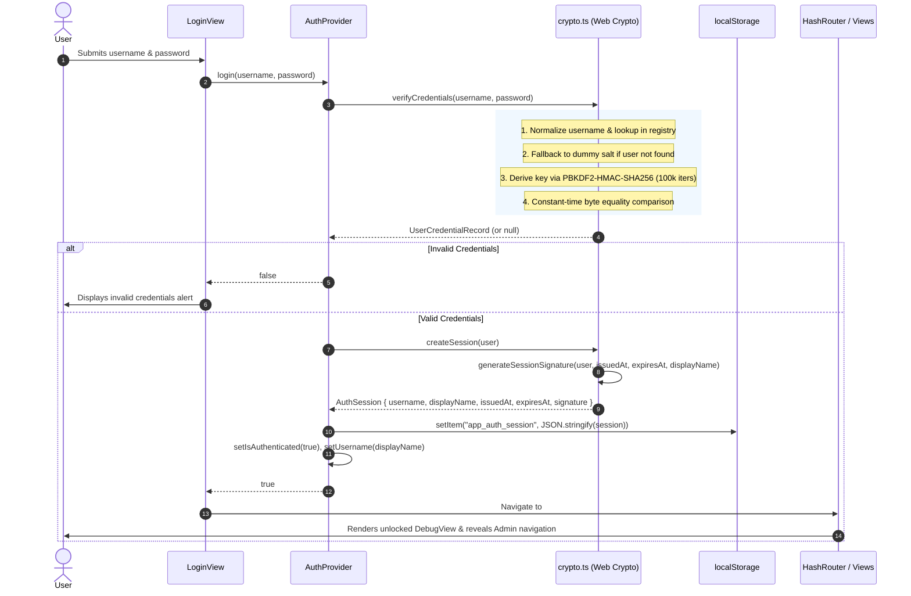

# Web Sloplication (ReactWeb)

A modern React 19 web application built with Vite 8, Tailwind CSS v4, Lucide React icons, and TypeScript.

Used to test agentic harnesses and models understanding of intent, behaviour, and design across multiple refactors.

## Prerequisites

- pnpm 11.23+

## Quick Start

1. Install dependencies:

   ```bash
   pnpm install
   ```

2. Start the local development server:

   ```bash
   pnpm dev
   ```

3. Open browser at `http://localhost:5173`.

## Available Scripts

| Command | Description |
| :--- | :--- |
| `pnpm dev` | Start the local Vite development server with HMR |
| `pnpm lint` | Type-check and lint the TypeScript codebase with `tsc --noEmit` |
| `pnpm build` | Run type-check and build production assets to `dist/` |
| `pnpm preview` | Locally preview the production build output |
| `pnpm run auth:hash` | Generate random salt and PBKDF2 hash for a password |
| `pnpm run md:lint` | Lint all markdown files with markdownlint-cli2 |

## Authentication Architecture

The application implements a client-side cryptographic authentication system using the Web Crypto API.

### Authentication Flow Diagram



### Considerations

#### 1. Credential Verification (`src/lib/crypto.ts`)

- **PBKDF2 Key Derivation**: Passwords are mathematically derived using PBKDF2-HMAC-SHA256 with 100,000 iterations
  and per-user cryptographic salts.
- **Timing Attack Mitigation**: Credential verification executes dummy key derivation (`DUMMY_SALT_HEX` and
  `DUMMY_ITERATIONS`) on invalid or non-existent usernames. This guarantees uniform execution duration, preventing
  user enumeration via timing analysis.
- **Constant-Time Comparison**: Byte buffers are compared using bitwise XOR (`constantTimeEqual`) to prevent
  early-exit timing leaks during hash comparisons.

#### 2. Tamper-Proof Session Management

- **Cryptographic Signatures**: Upon successful verification, an `AuthSession` object is generated with a SHA-256
  signature binding identity fields, credentials, and timestamps:
  `user.username:displayName:saltHex:hashHex:issuedAt:expiresAt`.
- **Expiration & Validation**: Sessions are valid for 7 days (`AUTH_SESSION_DURATION_MS = 604,800,000 ms`). On startup
  and cross-tab storage events, `validateSession` verifies data structure, temporal bounds, and signature integrity
  before authenticating. Any tampering or expiration purges the session.
- **Multi-Tab Synchronization**: `AuthProvider` listens for window `storage` events to synchronize authentication
  state across browser tabs in real-time.

#### 3. Protected Routing & Dynamic Navigation

- **Anchor Hash Routing**: Views route via anchor hashes (e.g. `#homepage`, `#settings`, `#login`, `#debug`).
- **Dynamic View Exposure**: Authenticated state unlocks protected views such as `#debug` (`requiresAuth: true`) in the
  sidebar navigation. Direct hash navigation to protected views when unauthenticated renders an unauthorized banner.

### Adding New Users

To register a new user in the client-side credential registry (`AUTH_USER_REGISTRY` in `src/constants.ts`),
generate a unique 16-byte cryptographic salt and derive the PBKDF2-HMAC-SHA256 hash using 100,000 iterations.

#### 1/2: Run the Hash Generation Command

Execute the credential hashing utility using `pnpm`, passing the desired password as an argument:

```bash
pnpm auth:hash -- "<PASSWORD>"
```

The command outputs a JSON object containing the generated `saltHex` and `hashHex`:

```json
{
  "saltHex": "3d20ec6d0b3760e268f68921d27a80f7",
  "hashHex": "f09eb45c8184758639b5c1910a4d382838103538d78439823aa6511266f1ec22"
}
```

#### 2/2: Add the User Record to `src/constants.ts`

Open `src/constants.ts` and add the new user record to `AUTH_USER_REGISTRY`:

```typescript
export const AUTH_USER_REGISTRY: Record<string, UserCredentialRecord> = {
  // Existing users...
  alice: {
    id: 'usr_alice',
    username: 'alice',
    displayName: 'Alice Cooper',
    saltHex: 'value-from-output',
    hashHex: 'value-from-output',
    iterations: 100000,
    role: 'user',
  },
};
```

Ensure the record key in `AUTH_USER_REGISTRY` is the lowercase normalized username (e.g. `alice`) so that
`verifyCredentials` matches user input during sign-in.
