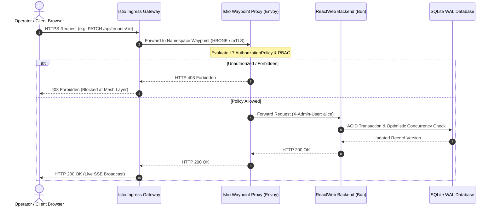
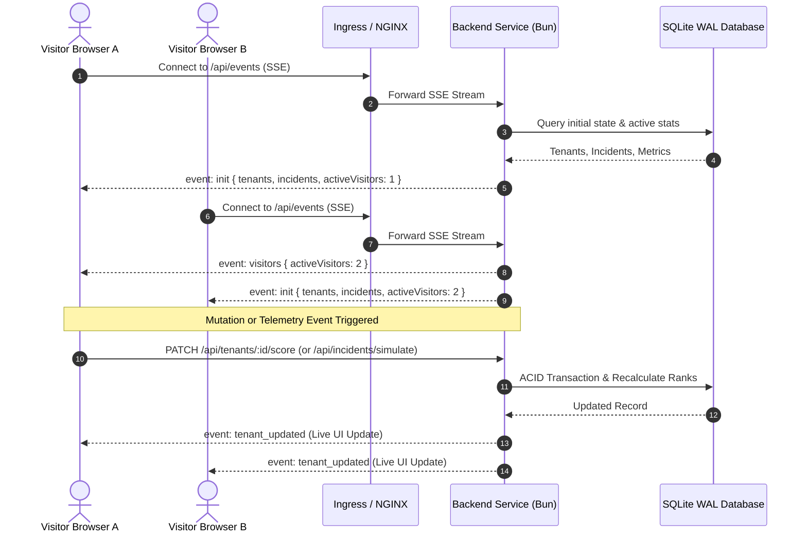

# Web Sloplication (ReactWeb)

A modern React 19 web application built with Vite 8, Tailwind CSS v4, Lucide React icons, and TypeScript.

Used to test agentic harnesses and models understanding of intent, behaviour, and design across multiple refactors.

## Prerequisites

- pnpm 11.23+

## Quick Start

1. Install dependencies:

   ```bash
   pnpm install
   ```

2. Start the local development server:

   ```bash
   pnpm dev
   ```

3. Open browser at `http://localhost:5173`.

## Available Scripts

| Command | Description |
| :--- | :--- |
| `pnpm dev` | Start the local Vite development server with HMR |
| `pnpm run server` | Start the native Bun SQLite WAL backend server |
| `pnpm run server:dev` | Start the backend server in watch mode with automatic restart |
| `pnpm lint` | Type-check and lint the TypeScript codebase with `tsc --noEmit` |
| `pnpm build` | Run type-check and build production assets to `dist/` |
| `pnpm preview` | Locally preview the production build output |
| `pnpm run dev:modify` | Modify live database records from terminal with developer attribution |
| `pnpm run md:lint` | Lint all markdown files with markdownlint-cli2 |

## Service Mesh & Istio Waypoint Authorization Architecture

In-app authentication and client-side cryptographic credential validation have been removed from the application
codebase. Access control and Layer 7 policy enforcement are delegated upstream to Istio Waypoint proxies within the
Istio Ambient Service Mesh.

### Mesh Authorization Flow


```mermaid
sequenceDiagram
    autonumber
    actor Operator as Operator / Client Browser
    participant Gateway as Istio Ingress Gateway
    participant Waypoint as Istio Waypoint Proxy (Envoy)
    participant Backend as ReactWeb Backend (Bun)
    participant SQLite as SQLite WAL Database

    Operator->>Gateway: HTTPS Request (e.g. PATCH /api/tenants/:id)
    Gateway->>Waypoint: Forward to Namespace Waypoint (HBONE / mTLS)
    Note over Waypoint: Evaluate L7 AuthorizationPolicy & RBAC
    alt Unauthorized / Forbidden
        Waypoint-->>Gateway: HTTP 403 Forbidden
        Gateway-->>Operator: 403 Forbidden (Blocked at Mesh Layer)
    else Policy Allowed
        Waypoint->>Backend: Forward Request (X-Admin-User: alice)
        Backend->>SQLite: ACID Transaction & Optimistic Concurrency Check
        SQLite-->>Backend: Updated Record Version
        Backend-->>Waypoint: HTTP 200 OK
        Waypoint-->>Gateway: HTTP 200 OK
        Gateway-->>Operator: HTTP 200 OK (Live SSE Broadcast)
    end
```

### Architectural Principles

#### 1. Zero-Trust Layer 7 Enforcement

- **Istio Ambient Waypoint**: Layer 7 traffic inspection, mutual TLS (mTLS), and role-based access control (RBAC) are
  enforced by dedicated Waypoint Envoy proxies in the cluster namespace before packets reach the application.
- **Declarative Authorization Policies**: Mesh administrators manage security posture declaratively via standard
  Kubernetes custom resources (`AuthorizationPolicy` and `RequestAuthentication`).
- **Zero In-App Auth Fragility**: Removing passwords, PBKDF2 derivation, and session tokens from the frontend bundle
  eliminates client-side credential exposure and prevents cryptographic key derivation overhead on client devices.

#### 2. Stateless Backend & Identity Attribution

- **Identity Propagation**: When requests pass the Waypoint proxy, authenticated caller identities are propagated
  via standard HTTP headers (`X-Admin-User`). The backend server attributes database modifications directly to the
  calling operator or automation service (`lastUpdatedBy`).
- **Optimistic Concurrency Control (OCC)**: Concurrency conflicts are handled through monotonically incrementing
  record versions and SQLite WAL transactions, ensuring safe multi-operator collaboration without in-app locks.

#### 3. Direct Anchor Hash Routing

- **Seamless Navigation**: All application views (`#homepage`, `#microsoft`, `#settings`, `#debug`) route via anchor
  hashes and are directly accessible in the UI.
- **Decoupled Diagnostics**: The `#debug` diagnostics view displays active application state, build versions, and mesh
  gateway status (`Istio Ambient`) without requiring client-side session elevation.

---

## Real-Time Backend & Database Architecture

The backend database server provides real-time telemetry streaming and persistent state management.


```mermaid
sequenceDiagram
    autonumber
    actor VisitorA as Visitor Browser A
    actor VisitorB as Visitor Browser B
    participant Ingress as Ingress / NGINX
    participant Backend as Backend Service (Bun)
    participant SQLite as SQLite WAL Database

    VisitorA->>Ingress: Connect to /api/events (SSE)
    Ingress->>Backend: Forward SSE Stream
    Backend->>SQLite: Query initial state & active stats
    SQLite-->>Backend: Tenants, Incidents, Metrics
    Backend-->>VisitorA: event: init { tenants, incidents, activeVisitors: 1 }

    VisitorB->>Ingress: Connect to /api/events (SSE)
    Ingress->>Backend: Forward SSE Stream
    Backend-->>VisitorA: event: visitors { activeVisitors: 2 }
    Backend-->>VisitorB: event: init { tenants, incidents, activeVisitors: 2 }

    Note over VisitorA,Backend: Mutation or Telemetry Event Triggered
    VisitorA->>Backend: PATCH /api/tenants/:id/score (or /api/incidents/simulate)
    Backend->>SQLite: ACID Transaction & Recalculate Ranks
    SQLite-->>Backend: Updated Record
    Backend-->>VisitorA: event: tenant_updated (Live UI Update)
    Backend-->>VisitorB: event: tenant_updated (Live UI Update)
```

### Architectural Highlights

- **Embedded High-Performance SQLite**: Powered by native SQLite WAL mode enabling concurrent reads without locking
  write operations.
- **Zero-Dependency Security**: The backend server uses standard Bun built-in modules and Web Standards
  (Request/Response). Zero runtime npm packages means zero CVE vulnerability attack surface.
- **Server-Sent Events (SSE)**: Visitors establish a persistent HTTP streaming connection via `GET /api/events`.
  Whenever a tenant score changes or a threat incident triggers, updates are pushed to all open visitor browsers.
- **Live Visitor Telemetry**: Tracks active concurrent browser sessions and broadcasts presence changes in real time.
- **Heartbeat & Reconnection**: Periodic keepalive frames (`: heartbeat\n\n`) prevent proxy timeouts, and the
  client automatically recovers with exponential backoff on network interruptions.

---

## Cloud-Native Helm & FluxCD GitOps Architecture

The application uses an enterprise-grade, decoupled GitOps architecture that isolates stateful persistence from
stateless applications, preventing release blast radius cascades and eliminating configuration drift.

### Directory Structure

```text
├── clusters/                             # 1. FLUX ENTRYPOINTS (What runs where)
│   ├── staging/
│   │   ├── sources.yaml                  # Git & Helm repository definitions in flux-system
│   │   └── apps-sync.yaml                # Flux Kustomizations pointing to deploy/*/staging
│   └── production/
│       ├── sources.yaml                  # Git & Helm repository definitions in flux-system
│       └── apps-sync.yaml                # Flux Kustomizations pointing to deploy/*/production
│
└── deploy/                               # 2. APPLICATION STACK (Kustomize Layers)
    ├── database/                         # ---- STATEFUL INFRASTRUCTURE ----
    │   ├── kustomization.yaml            # Base Kustomize (points to helmrelease.yaml)
    │   ├── helmrelease.yaml              # App-template v3 library chart definition
    │   ├── staging/
    │   │   ├── kustomization.yaml        # Points UP to deploy/database/
    │   │   └── patch-env.yaml            # Staging: 1 replica, 5Gi storage
    │   └── production/
    │       ├── kustomization.yaml        # Points UP to deploy/database/
    │       └── patch-env.yaml            # Prod: 1 replica, 5Gi storage, prod resources
    │
    ├── frontend/                         # ---- FRONTEND APP ----
    │   ├── kustomization.yaml            # Base Kustomize (points to helmrelease.yaml)
    │   ├── helmrelease.yaml              # App-template v3 library chart definition
    │   ├── staging/
    │   │   ├── kustomization.yaml        # Points UP to deploy/frontend/
    │   │   └── patch-env.yaml            # Staging: 1 replica, staging URL
    │   └── production/
    │       ├── kustomization.yaml        # Points UP to deploy/frontend/
    │       └── patch-env.yaml            # Prod: 3 replicas, prod URL, TLS
    │
    └── processing/                       # ---- TELEMETRY PROCESSOR ----
        ├── kustomization.yaml            # Base Kustomize (points to helmrelease.yaml)
        ├── helmrelease.yaml              # App-template v3 library chart definition
        ├── staging/
        │   ├── kustomization.yaml        # Points UP to deploy/processing/
        │   └── patch-env.yaml            # Staging worker configuration
        └── production/
            ├── kustomization.yaml        # Points UP to deploy/processing/
            └── patch-env.yaml            # Prod worker configuration & resources
```

### Blast Radius & GitOps Decoupling

1. **No Superfluous Charts**: Completely eliminates bespoke chart maintenance by utilizing the industry-standard
   `bjw-s/app-template` v3 library chart declared in cluster-wide Helm repositories.
2. **Blast Radius Isolation**: Stateful database and stateless frontend/processing run as separate Helm releases.
   A frontend rollout failure or rollback never evaluates or interrupts database state or PVC persistence.
3. **Database PVC Bound**: Any database PVC is strictly configured to 5Gi across base, staging, and production.
4. **Cluster Source Hygiene**: Flux system sources (`GitRepository`, `HelmRepository`) reside in `clusters/`
   entrypoints, preventing staging and production from fighting over cluster resources.
5. **Native Kustomize Patches**: Environment tuning uses `patch-env.yaml` to patch `HelmRelease` `spec.values`
   directly, eliminating the raw values disconnect and avoiding `ConfigMapGenerator` workarounds.
6. **Dependency Orchestration**: `clusters/*/apps-sync.yaml` enforces `dependsOn: [reactweb-database-*]`, ensuring
   the database is ready before frontend or worker pods start.

```bash
# Preview production rendered manifests via Kustomize
kubectl kustomize deploy/database/production
kubectl kustomize deploy/processing/production
kubectl kustomize deploy/frontend/production

# Preview staging rendered manifests via Kustomize
kubectl kustomize deploy/database/staging
kubectl kustomize deploy/processing/staging
kubectl kustomize deploy/frontend/staging
```

---

## DevSecOps Security Posture

- **Non-Root Execution**: Both frontend (UID 101) and backend (UID 10001) run unprivileged.
- **Read-Only Root Filesystems**: Frontend runs with `readOnlyRootFilesystem: true`, mounting ephemeral `emptyDir`
  storage strictly for temp buffers.
- **Zero Linux Capabilities**: Containers drop all Linux capabilities (`capabilities: drop: ["ALL"]`) and enforce
  `allowPrivilegeEscalation: false`.
- **RuntimeDefault Seccomp**: Pods enforce standard system call filtration.
- **Zero-Trust Network Policies**: Ingress traffic to the database backend is restricted exclusively to frontend pods.
- **HTTP Security Headers**: Strict CSP, HSTS, X-Frame-Options (`DENY`), X-Content-Type-Options (`nosniff`), and
  Referrer-Policy headers are enforced at both NGINX and Bun application layers.

---

## Multi-Admin Concurrency & In-Cluster Telemetry Generator

### 1. Multi-Admin Concurrency Control

The SQLite database server implements Optimistic Concurrency Control (OCC) to safely coordinate updates published by
multiple administrators simultaneously:

- **Revision Versioning**: Every tenant record tracks a monotonically increasing integer `version` and `lastUpdatedBy`
  attribution.
- **Immediate Transactions**: Write operations use `BEGIN IMMEDIATE;` with `PRAGMA busy_timeout = 5000;` ensuring writes
  queue cleanly without database locks.
- **Conflict Trapping**: When Admin A publishes an update, the record version increments. If Admin B submits a
  mutation referencing an outdated version, the server rolls back and returns an `HTTP 409 Conflict` payload containing
  the latest server record, preventing accidental overwrite.
- **Interactive UI Editor**: Administrators can click "Edit" inside any `TenantDetailModal` to modify scores or toggle
  telemetry defenses, with live broadcast across all connected visitors.
- **Data-Agnostic Scaling**: The frontend `updateData<T>(resource, id, updates, options)` function is decoupled
  from specific schemas, enabling seamless scaling across any existing or future SQLite table (`tenants`, `incidents`,
  `site_metrics`, or arbitrary new collections). Real-time updates propagate across browsers via generic `data_updated`
  Server-Sent Events without requiring bespoke endpoints or client adapters.

### 2. In-Cluster Telemetry Generator (Processing Pod Daemon)

A Kubernetes-native telemetry generator script ([`scripts/k8s-telemetry-generator.js`](file:///c:/Users/Bob/Documents/GitHub/ReactWeb/scripts/k8s-telemetry-generator.js))
runs directly inside the cluster namespace:

- **Schedule**: Deployed via Flux [`HelmRelease`](file:///c:/Users/Bob/Documents/GitHub/ReactWeb/deploy/processing/helmrelease.yaml)
  running as a continuous processing daemon with periodic heartbeat health checks.
- **Batch Processing**: Dispatches atomic mutations to `POST /api/internal/batch-update-tenants`. The server executes
  a single SQLite transaction updating all 200 rows and re-ranking the entire leaderboard in under 35ms.
- **Live Visitor Push**: Immediately broadcasts a `tenants_batch_updated` SSE event to all connected browsers,
  refreshing leaderboard ranks, scores, charts, and podiums across all visitors without reloading the page.
- **Local Execution**:

  ```bash
  # Run once
  pnpm run telemetry:cron:once

  # Run continuous 60-second loop
  pnpm run telemetry:cron
  ```

### 3. Multi-Developer Namespace Authorization & Database Mutations

The application delegates Layer 7 authorization to the upstream Istio Waypoint proxy while preserving developer
attribution across all database mutations:

- **Multi-Developer Access**: Multiple operators (`admin`, `alice`, `bob`, `charlie`) collaborate and publish live
  database updates.
- **Mesh-Enforced Authorization**: Ingress and Waypoint proxies enforce L7 access policies before requests reach the
  backend. Mutations are attributed to the identity in `X-Admin-User` (falling back to `operator` or `system`).
- **Developer Attribution**: Every mutation records `lastUpdatedBy` in SQLite WAL, displaying the modifying operator
  in the UI badge pill (e.g. `by alice`).
- **Live SSE Push to All Visitors**: All mutations immediately broadcast `data_updated` and `tenant_updated` events
  over Server-Sent Events, instantly reflecting updates across all connected visitor browsers.
- **Web UI & CLI Mutation**:
  - **Web UI**: Operators click "Edit" in tenant detail modals to adjust scores and status flags with live broadcast.
  - **Developer CLI**: Run `pnpm run dev:modify -- --tenant tenant-001 --score 98.5 --as alice` to execute direct
    mutations from terminal sessions or Kubernetes pods.
