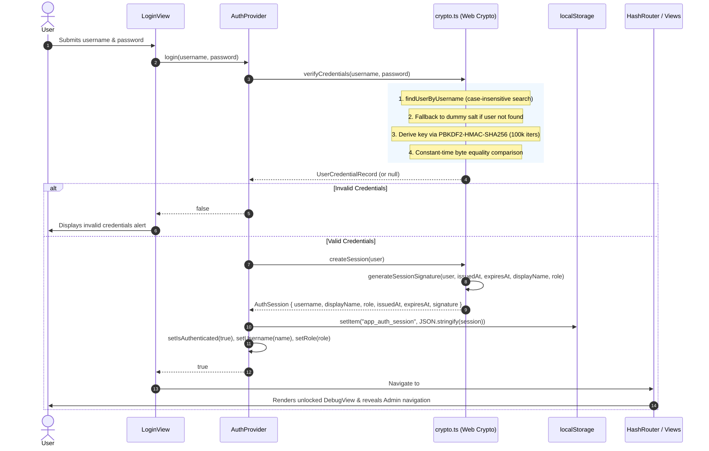
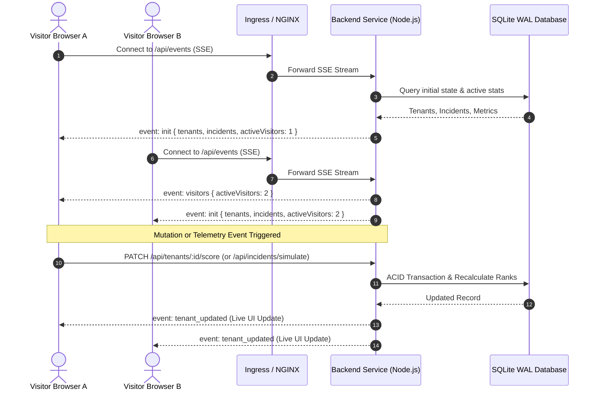

# Web Sloplication (ReactWeb)

A modern React 19 web application built with Vite 8, Tailwind CSS v4, Lucide React icons, and TypeScript.

Used to test agentic harnesses and models understanding of intent, behaviour, and design across multiple refactors.

## Prerequisites

- pnpm 11.23+

## Quick Start

1. Install dependencies:

   ```bash
   pnpm install
   ```

2. Start the local development server:

   ```bash
   pnpm dev
   ```

3. Open browser at `http://localhost:5173`.

## Available Scripts

| Command | Description |
| :--- | :--- |
| `pnpm dev` | Start the local Vite development server with HMR |
| `pnpm run server` | Start the secure Node.js SQLite WAL backend server |
| `pnpm run server:dev` | Start the backend server in watch mode with automatic restart |
| `pnpm lint` | Type-check and lint the TypeScript codebase with `tsc --noEmit` |
| `pnpm build` | Run type-check and build production assets to `dist/` |
| `pnpm preview` | Locally preview the production build output |
| `pnpm run auth:hash` | Generate random salt and PBKDF2 hash for a password |
| `pnpm run md:lint` | Lint all markdown files with markdownlint-cli2 |

## Authentication Architecture

The application implements a client-side cryptographic authentication system using the Web Crypto API.

### Authentication Flow Diagram


```mermaid
sequenceDiagram
    autonumber
    actor User
    participant LoginView as LoginView
    participant AuthContext as AuthProvider
    participant Crypto as crypto.ts (Web Crypto)
    participant Storage as localStorage
    participant Navigation as HashRouter / Views

    User->>LoginView: Submits username & password
    LoginView->>AuthContext: login(username, password)
    AuthContext->>Crypto: verifyCredentials(username, password)

    rect rgb(240, 248, 255)
        Note over Crypto: 1. findUserByUsername (case-insensitive search)
        Note over Crypto: 2. Fallback to dummy salt if user not found
        Note over Crypto: 3. Derive key via PBKDF2-HMAC-SHA256 (100k iters)
        Note over Crypto: 4. Constant-time byte equality comparison
    end

    Crypto-->>AuthContext: UserCredentialRecord (or null)

    alt Invalid Credentials
        AuthContext-->>LoginView: false
        LoginView->>User: Displays invalid credentials alert
    else Valid Credentials
        AuthContext->>Crypto: createSession(user)
        Crypto->>Crypto: generateSessionSignature(user, issuedAt, expiresAt, displayName, role)
        Crypto-->>AuthContext: AuthSession { username, displayName, role, issuedAt, expiresAt, signature }
        AuthContext->>Storage: setItem("app_auth_session", JSON.stringify(session))
        AuthContext->>AuthContext: setIsAuthenticated(true), setUsername(name), setRole(role)
        AuthContext-->>LoginView: true
        LoginView->>Navigation: Navigate to #debug
        Navigation->>User: Renders unlocked DebugView & reveals Admin navigation
    end
```

### Considerations

#### 1. Credential Verification (`src/lib/crypto.ts`)

- **Array-Based Registry & Resilient Search**: `AUTH_USER_REGISTRY` is structured as a `UserCredentialRecord[]` array.
  Lookups use `findUserByUsername`, performing case-insensitive, whitespace-trimmed matching that fully supports
  usernames containing digits, underscores, dashes, emails, and symbols (e.g. `user_123`, `admin@domain.com`).
- **PBKDF2 Key Derivation**: Passwords are mathematically derived using PBKDF2-HMAC-SHA256 with 100,000 iterations
  and per-user cryptographic salts.
- **Timing Attack Mitigation**: Credential verification executes dummy key derivation (`DUMMY_SALT_HEX` and
  `DUMMY_ITERATIONS`) on invalid or non-existent usernames. This guarantees uniform execution duration, preventing
  user enumeration via timing analysis.
- **Constant-Time Comparison**: Byte buffers are compared using bitwise XOR (`constantTimeEqual`) to prevent
  early-exit timing leaks during hash comparisons.

#### 2. Tamper-Proof Session Management

- **Cryptographic Signatures**: Upon successful verification, an `AuthSession` object is generated with a SHA-256
  signature binding identity fields, roles, credentials, and timestamps:
  `user.username:displayName:role:saltHex:hashHex:issuedAt:expiresAt`.
- **Expiration & Validation**: Sessions are valid for 7 days (`AUTH_SESSION_DURATION_MS = 604,800,000 ms`). On startup
  and cross-tab storage events, `validateSession` verifies data structure, role consistency, temporal bounds, and
  signature integrity before authenticating. Any tampering or expiration purges the session.
- **Multi-Tab Synchronization**: `AuthProvider` listens for window `storage` events to synchronize authentication
  state across browser tabs in real-time.

#### 3. Protected Routing & Dynamic Navigation

- **Anchor Hash Routing**: Views route via anchor hashes (e.g. `#homepage`, `#settings`, `#login`, `#debug`).
- **Dynamic View Exposure**: Authenticated state unlocks protected views such as `#debug` (`requiresAuth: true`) in the
  sidebar navigation. Direct hash navigation to protected views when unauthenticated renders an unauthorized banner.

### Adding New Users

To register a new user in the client-side credential registry (`AUTH_USER_REGISTRY` in `src/constants.ts`),
generate a unique 16-byte cryptographic salt and derive the PBKDF2-HMAC-SHA256 hash using 100,000 iterations.

#### 1/2: Run the Hash Generation Command

Execute the credential hashing utility using `pnpm`, passing the desired password as an argument:

```bash
pnpm auth:hash -- "<PASSWORD>"
```

The command outputs a JSON object containing the generated `saltHex` and `hashHex`:

```json
{
  "saltHex": "3d20ec6d0b3760e268f68921d27a80f7",
  "hashHex": "f09eb45c8184758639b5c1910a4d382838103538d78439823aa6511266f1ec22"
}
```

#### 2/2: Add the User Record to `src/constants.ts`

Open `src/constants.ts` and append the new user record to `AUTH_USER_REGISTRY`:

```typescript
export const AUTH_USER_REGISTRY: UserCredentialRecord[] = [
  // Existing users...
  {
    id: 'usr_alice',
    username: 'alice_99@domain.com',
    displayName: 'Alice Cooper',
    saltHex: 'value-from-output',
    hashHex: 'value-from-output',
    iterations: 100000,
    role: 'user',
  },
];
```

The registry fully supports usernames containing numbers, symbols, and special characters (e.g. `user_123`,
`admin@domain.com`, `ops-lead+01`). Matching is case-insensitive and whitespace-trimmed during sign-in.

---

## Real-Time Backend & Database Architecture

The backend database server provides real-time telemetry streaming and persistent state management.


```mermaid
sequenceDiagram
    autonumber
    actor VisitorA as Visitor Browser A
    actor VisitorB as Visitor Browser B
    participant Ingress as Ingress / NGINX
    participant Backend as Backend Service (Node.js)
    participant SQLite as SQLite WAL Database

    VisitorA->>Ingress: Connect to /api/events (SSE)
    Ingress->>Backend: Forward SSE Stream
    Backend->>SQLite: Query initial state & active stats
    SQLite-->>Backend: Tenants, Incidents, Metrics
    Backend-->>VisitorA: event: init { tenants, incidents, activeVisitors: 1 }

    VisitorB->>Ingress: Connect to /api/events (SSE)
    Ingress->>Backend: Forward SSE Stream
    Backend-->>VisitorA: event: visitors { activeVisitors: 2 }
    Backend-->>VisitorB: event: init { tenants, incidents, activeVisitors: 2 }

    Note over VisitorA,Backend: Mutation or Telemetry Event Triggered
    VisitorA->>Backend: PATCH /api/tenants/:id/score (or /api/incidents/simulate)
    Backend->>SQLite: ACID Transaction & Recalculate Ranks
    SQLite-->>Backend: Updated Record
    Backend-->>VisitorA: event: tenant_updated (Live UI Update)
    Backend-->>VisitorB: event: tenant_updated (Live UI Update)
```

### Architectural Highlights

- **Embedded High-Performance SQLite**: Powered by Node 22+ native `node:sqlite` (`DatabaseSync`). Write-Ahead
  Logging (WAL) mode enables concurrent reads without locking write operations.
- **Zero-Dependency Security**: The backend server uses standard Node.js built-in modules (`node:http`,
  `node:sqlite`, `node:fs`). Zero runtime npm packages means zero CVE vulnerability attack surface.
- **Server-Sent Events (SSE)**: Visitors establish a persistent HTTP streaming connection via `GET /api/events`.
  Whenever a tenant score changes or a threat incident triggers, updates are pushed to all open visitor browsers.
- **Live Visitor Telemetry**: Tracks active concurrent browser sessions and broadcasts presence changes in real time.
- **Heartbeat & Reconnection**: Periodic keepalive frames (`: heartbeat\n\n`) prevent proxy timeouts, and the
  client automatically recovers with exponential backoff on network interruptions.

---

## Cloud-Native Helm & FluxCD GitOps Architecture

The application uses an enterprise-grade, decoupled GitOps architecture that isolates stateful persistence from
stateless applications, preventing release blast radius cascades and eliminating configuration drift.

### Directory Structure

```text
├── clusters/                             # 1. FLUX ENTRYPOINTS (What runs where)
│   ├── staging/
│   │   ├── sources.yaml                  # Git & Helm repository definitions in flux-system
│   │   └── apps-sync.yaml                # Flux Kustomizations pointing to deploy/*/staging
│   └── production/
│       ├── sources.yaml                  # Git & Helm repository definitions in flux-system
│       └── apps-sync.yaml                # Flux Kustomizations pointing to deploy/*/production
│
└── deploy/                               # 2. APPLICATION STACK (Kustomize Layers)
    ├── database/                         # ---- STATEFUL INFRASTRUCTURE ----
    │   ├── kustomization.yaml            # Base Kustomize (points to helmrelease.yaml)
    │   ├── helmrelease.yaml              # App-template v3 library chart definition
    │   ├── staging/
    │   │   ├── kustomization.yaml        # Points UP to deploy/database/
    │   │   └── patch-env.yaml            # Staging: 1 replica, 5Gi storage
    │   └── production/
    │       ├── kustomization.yaml        # Points UP to deploy/database/
    │       └── patch-env.yaml            # Prod: 1 replica, 5Gi storage, prod resources
    │
    ├── frontend/                         # ---- FRONTEND APP ----
    │   ├── kustomization.yaml            # Base Kustomize (points to helmrelease.yaml)
    │   ├── helmrelease.yaml              # App-template v3 library chart definition
    │   ├── staging/
    │   │   ├── kustomization.yaml        # Points UP to deploy/frontend/
    │   │   └── patch-env.yaml            # Staging: 1 replica, staging URL
    │   └── production/
    │       ├── kustomization.yaml        # Points UP to deploy/frontend/
    │       └── patch-env.yaml            # Prod: 3 replicas, prod URL, TLS
    │
    └── processing/                       # ---- TELEMETRY PROCESSOR ----
        ├── kustomization.yaml            # Base Kustomize (points to helmrelease.yaml)
        ├── helmrelease.yaml              # App-template v3 library chart definition
        ├── staging/
        │   ├── kustomization.yaml        # Points UP to deploy/processing/
        │   └── patch-env.yaml            # Staging worker configuration
        └── production/
            ├── kustomization.yaml        # Points UP to deploy/processing/
            └── patch-env.yaml            # Prod worker configuration & resources
```

### Blast Radius & GitOps Decoupling

1. **No Superfluous Charts**: Completely eliminates bespoke chart maintenance by utilizing the industry-standard
   `bjw-s/app-template` v3 library chart declared in cluster-wide Helm repositories.
2. **Blast Radius Isolation**: Stateful database and stateless frontend/processing run as separate Helm releases.
   A frontend rollout failure or rollback never evaluates or interrupts database state or PVC persistence.
3. **Database PVC Bound**: Any database PVC is strictly configured to 5Gi across base, staging, and production.
4. **Cluster Source Hygiene**: Flux system sources (`GitRepository`, `HelmRepository`) reside in `clusters/`
   entrypoints, preventing staging and production from fighting over cluster resources.
5. **Native Kustomize Patches**: Environment tuning uses `patch-env.yaml` to patch `HelmRelease` `spec.values`
   directly, eliminating the raw values disconnect and avoiding `ConfigMapGenerator` workarounds.
6. **Dependency Orchestration**: `clusters/*/apps-sync.yaml` enforces `dependsOn: [reactweb-database-*]`, ensuring
   the database is ready before frontend or worker pods start.

```bash
# Preview production rendered manifests via Kustomize
kubectl kustomize deploy/database/production
kubectl kustomize deploy/processing/production
kubectl kustomize deploy/frontend/production

# Preview staging rendered manifests via Kustomize
kubectl kustomize deploy/database/staging
kubectl kustomize deploy/processing/staging
kubectl kustomize deploy/frontend/staging
```

---

## DevSecOps Security Posture

- **Non-Root Execution**: Both frontend (UID 101) and backend (UID 10001) run unprivileged.
- **Read-Only Root Filesystems**: Frontend runs with `readOnlyRootFilesystem: true`, mounting ephemeral `emptyDir`
  storage strictly for temp buffers.
- **Zero Linux Capabilities**: Containers drop all Linux capabilities (`capabilities: drop: ["ALL"]`) and enforce
  `allowPrivilegeEscalation: false`.
- **RuntimeDefault Seccomp**: Pods enforce standard system call filtration.
- **Zero-Trust Network Policies**: Ingress traffic to the database backend is restricted exclusively to frontend pods.
- **HTTP Security Headers**: Strict CSP, HSTS, X-Frame-Options (`DENY`), X-Content-Type-Options (`nosniff`), and
  Referrer-Policy headers are enforced at both NGINX and Node.js layers.

---

## Multi-Admin Concurrency & In-Cluster Telemetry Generator

### 1. Multi-Admin Concurrency Control

The SQLite database server implements Optimistic Concurrency Control (OCC) to safely coordinate updates published by
multiple administrators simultaneously:

- **Revision Versioning**: Every tenant record tracks a monotonically increasing integer `version` and `lastUpdatedBy`
  attribution.
- **Immediate Transactions**: Write operations use `BEGIN IMMEDIATE;` with `PRAGMA busy_timeout = 5000;` ensuring writes
  queue cleanly without database locks.
- **Conflict Trapping**: When Admin A publishes an update, the record version increments. If Admin B submits a
  mutation referencing an outdated version, the server rolls back and returns an `HTTP 409 Conflict` payload containing
  the latest server record, preventing accidental overwrite.
- **Interactive UI Editor**: Administrators can click "Edit" inside any `TenantDetailModal` to modify scores or toggle
  telemetry defenses, with live broadcast across all connected visitors.
- **Data-Agnostic Scaling**: The frontend `updateData<T>(resource, id, updates, options)` function is decoupled
  from specific schemas, enabling seamless scaling across any existing or future SQLite table (`tenants`, `incidents`,
  `site_metrics`, or arbitrary new collections). Real-time updates propagate across browsers via generic `data_updated`
  Server-Sent Events without requiring bespoke endpoints or client adapters.

### 2. In-Cluster Telemetry Generator (Processing Pod Daemon)

A Kubernetes-native telemetry generator script ([`scripts/k8s-telemetry-generator.js`](file:///c:/Users/Bob/Documents/GitHub/ReactWeb/scripts/k8s-telemetry-generator.js))
runs directly inside the cluster namespace:

- **Schedule**: Deployed via Flux [`HelmRelease`](file:///c:/Users/Bob/Documents/GitHub/ReactWeb/deploy/processing/helmrelease.yaml)
  running as a continuous processing daemon with periodic heartbeat health checks.
- **Batch Processing**: Dispatches atomic mutations to `POST /api/internal/batch-update-tenants`. The server executes
  a single SQLite transaction updating all 200 rows and re-ranking the entire leaderboard in under 35ms.
- **Live Visitor Push**: Immediately broadcasts a `tenants_batch_updated` SSE event to all connected browsers,
  refreshing leaderboard ranks, scores, charts, and podiums across all visitors without reloading the page.
- **Local Execution**:

  ```bash
  # Run once
  pnpm run telemetry:cron:once

  # Run continuous 60-second loop
  pnpm run telemetry:cron
  ```
